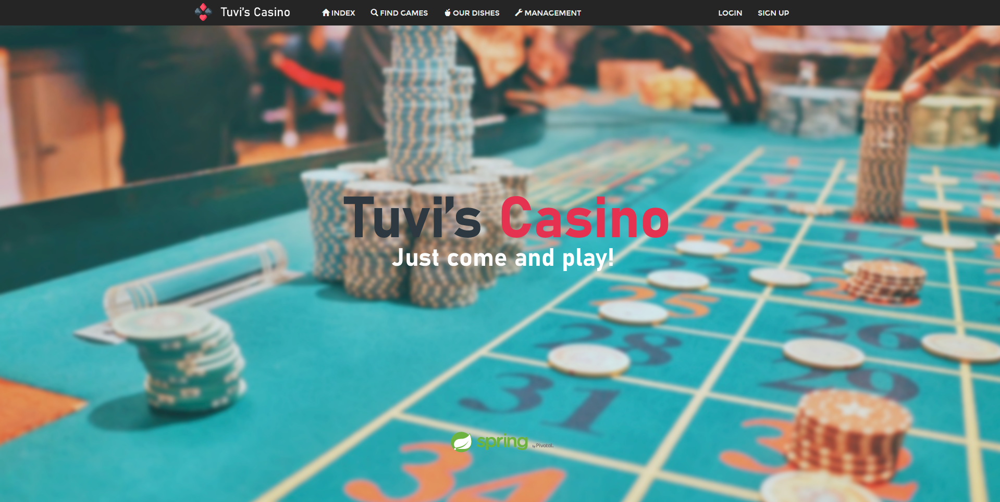

# Tuvi's Casino

This is the project of the group 01-07

## About the casino
Tuvi’s Casino is a gambling games center which has among their facilities services such as a restaurant, where visitors can have whatever meal they desire in the moment, some show scenarios, where artists perform their shows on a daily basis, and a lot of gaming tables and slot machines

## The goal of our project
The goal of our Project is to develop a website with which the admins of Tuvi’s Casino will be able to successfully manage their business. 
This website is going to contain features such login for each different type of user (admin, employee, and client). Depending on the kind of user that is logged on the website, it will able him to manage different things. 

You can then access to our webpage here: http://localhost:8090/

This project uses Java 11

## Documents 

- [Document of System Design](https://github.com/gii-is-DP1/dp1-2020-g1-07/blob/master/documents/DP1-G1-7%20-%20Document%20of%20System%20Design.docx)
- [Document of Requirements and System Analysis] (https://github.com/gii-is-DP1/dp1-2020-g1-07/blob/master/documents/DP1-G1-7-Document%20of%20Requirements%20and%20System%20Analysis.docx)

## In case you find a bug/suggested improvement for Tuvi's Casino project
Our issue tracker is available here: https://github.com/gii-is-DP1/dp1-2020-g1-07/issues
